# 따라하기: 논문 한 편에서 RQ까지 (VS Code + Claude Code)

대상 논문 Park et al., "Field-programmable robotic folding sheet"(*Nature Communications* 16, 6937, 2025)를 관련 논문과 비교해 연구 질문(RQ) 후보를 만드는 전 과정(0–5단계)과, 같은 위키로 대상 논문 설명 페이지를 만드는 추가 실습(6단계)을 VS Code 화면으로 따라간다.

- 화면은 2026-09-29에 이 작업공간과 같은 시작 상태(당시 폴더 이름 `workspace`)에서 실제로 실행하며 캡처했다. 그때 만들어진 파일은 `../mns_tutorial_2026_example/`에 있다.
- Claude의 응답은 실행할 때마다 달라진다. 문장이 똑같지 않아도 된다. **결과 파일이 생겼는지, 규칙(원문 위치, `[추론]`, `needs_review`)이 지켜졌는지**를 확인한다.
- 막히면 `../mns_tutorial_2026_example/`에서 같은 단계의 파일을 보거나 복사한다.

## 준비물

- VS Code
- Claude Code 확장: VS Code 확장(Extensions) 탭에서 "Claude Code"(게시자 Anthropic)를 검색해 설치하고 로그인한다.
- Python 3: 에이전트가 PDF를 다룰 때 쓴다. 이 실행에서 쓴 패키지를 미리 설치해 두면 확인 창이 줄어든다.
  ```
  pip install requests pypdf pymupdf
  ```
  - `requests`: PDF 내려받기(2단계) · `pypdf`: 쪽수와 본문 읽기(3–4단계) · `pymupdf`: 그림 잘라 내기(6단계)
- 인터넷 연결: OpenAlex와 출판사 사이트에서 OA 논문을 받는다.

---

## 0단계. 작업공간 열기

1. VS Code에서 **File > Open Folder**로 이 폴더(`mns_tutorial_2026_blank`)를 연다.
2. `papers/seed_papers.csv`를 연다. DOI가 적힌 논문 6편의 목록이다. `wiki/`와 `explainer/`는 비어 있다.

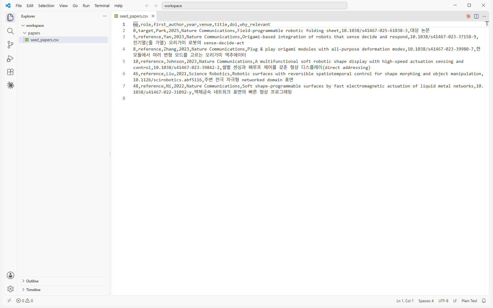

---

## 1단계. CLAUDE.md 쓰기

CLAUDE.md는 Claude Code가 대화를 시작할 때마다 자동으로 읽는 프로젝트 규칙이다.

1. 작업공간 최상위에 `CLAUDE.md`를 만든다. "프로젝트 목표"는 자기 말로 쓰고, 나머지는 `../mns_tutorial_2026_example/CLAUDE.md`를 참고한다(작업 흐름 5번 줄은 6단계에서 더한다).
   - 담을 것: 프로젝트 목표, 작업 흐름과 폴더, 검증 규칙, RQ 형식

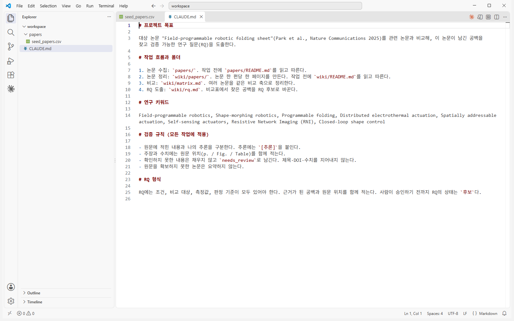

2. 편집기 오른쪽 위의 **주황색 Claude 아이콘**을 눌러 Claude Code를 연다.
   - 입력창 오른쪽 아래의 **Edit automatically**는 파일 편집을 자동으로 승인하는 모드다. Shift+Tab으로 바꿀 수 있다. 명령 실행(Bash)은 미리 허용한 명령이 아니면 이 모드에서도 따로 묻는다.

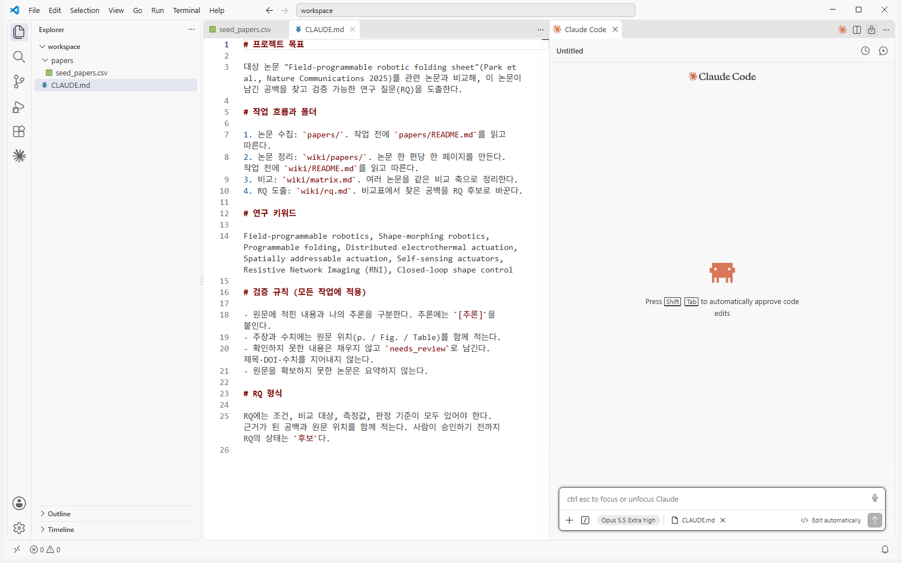

3. 규칙이 제대로 읽혔는지 확인한다.

```
CLAUDE.md를 읽고, 이 프로젝트에서 네가 할 일과 반드시 지킬 규칙을 다섯 줄 이내로 말해줘.
```

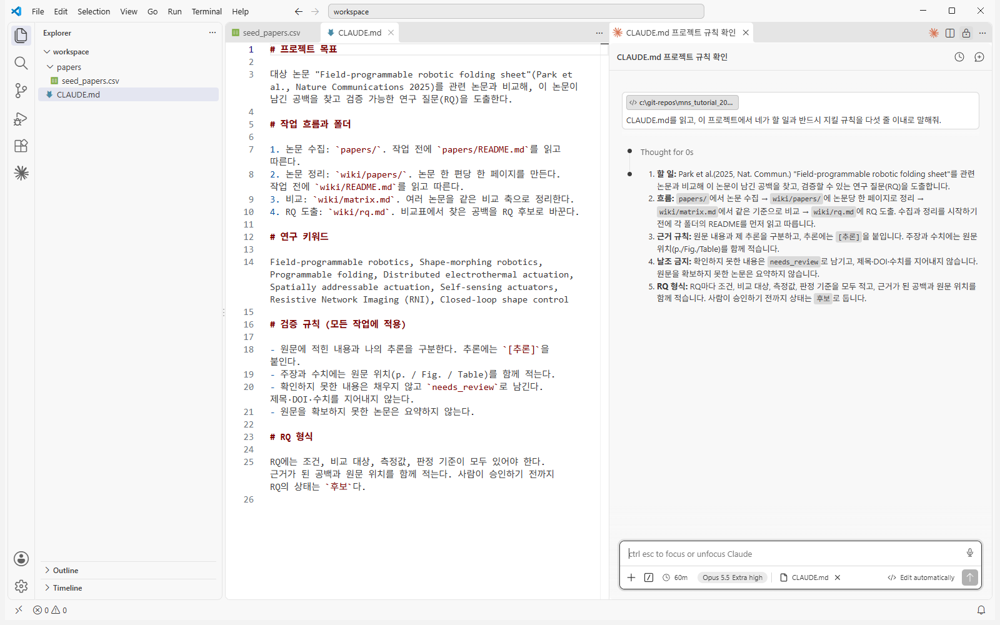

**확인**: 목표, 작업 흐름, `[추론]` 표시, `needs_review`, RQ 형식이 응답에 모두 나오면 된다.

---

## 2단계. CSV로 OA 논문 수집

1. `papers/README.md`를 네 칸(역할 / 입력 → 출력 / 작업 순서 / 지킬 것)으로 쓴다. `../mns_tutorial_2026_example/papers/README.md`를 참고한다.

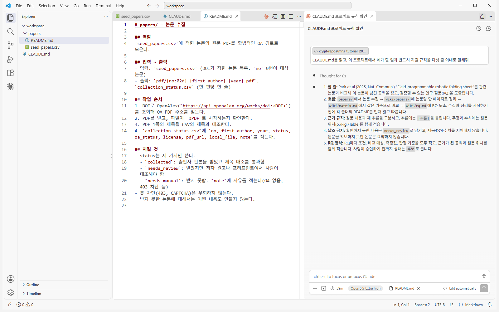

2. 수집을 요청한다.

```
papers/README.md 규칙에 따라 papers/seed_papers.csv의 논문을 수집해줘. 끝나면 status별 건수를 표로 보여줘.
```

3. 진행 중에는 에이전트가 어떤 파일을 읽고(Read) 어떤 명령을 실행하는지(Bash) 차례로 보인다.

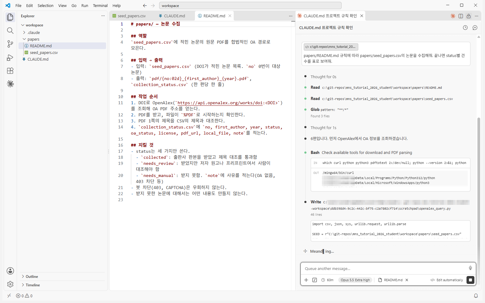

4. 결과: 5편 `collected`, 1편 `needs_manual`.
   - Liu 2021(Science Robotics)은 OA 경로가 없어 받지 못했다. 에이전트는 이 논문을 채우지 않고 `needs_manual`로 남긴다.
   - 에이전트가 CSV의 제목과 PDF 1쪽 제목을 대조하다가 CSV 쪽에 쉼표가 빠진 것까지 찾아 `note`에 적었다.

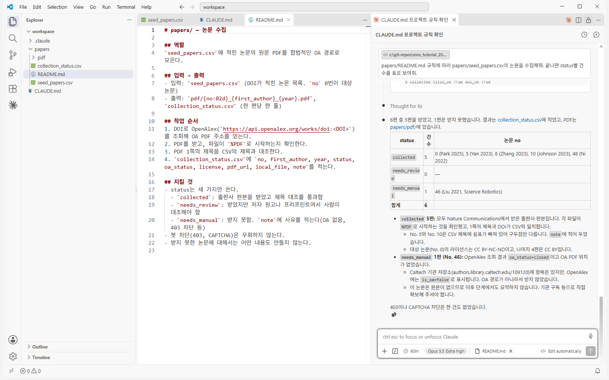

5. `papers/pdf/`에 PDF 5편이, `collection_status.csv`에 한 편당 한 줄씩 결과가 생긴다.

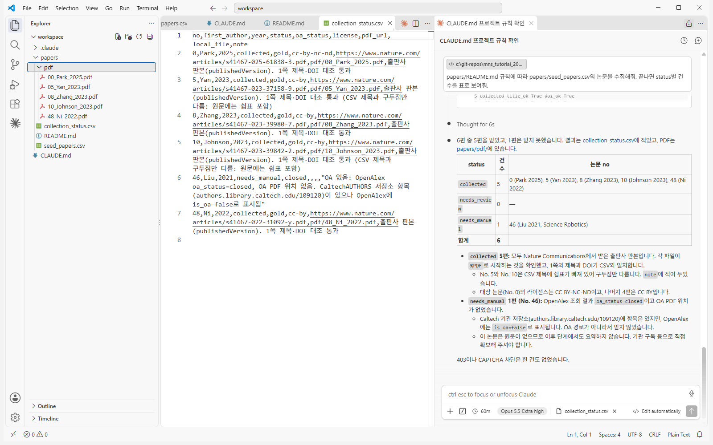

---

## 3단계. 대상 논문 위키 페이지 + 원문 대조

1. `wiki/README.md`와 `wiki/papers/_template.md`를 만든다. `../mns_tutorial_2026_example/wiki/`에서 복사해도 된다.
   - 복사한 README의 작업 순서에는 허브 만들기(5번)와 `wiki/log.md` 변경 기록(6번)이 들어 있다. 캡처할 때의 README에는 없던 단계라 화면과 조금 다르게 진행될 수 있다.

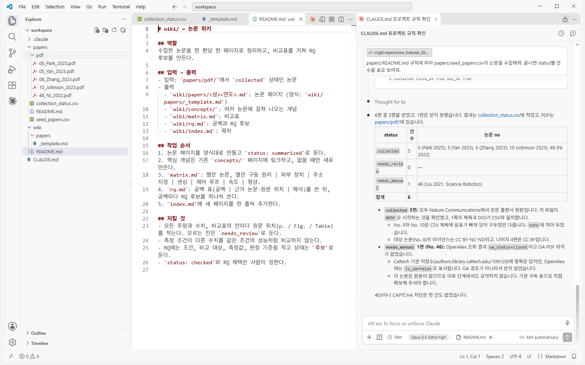

2. 대상 논문 페이지를 요청한다.

```
wiki/README.md 규칙에 따라 대상 논문(no 0, Park 2025)의 위키 페이지를 만들어줘.
```

3. **명령 실행 확인 창**이 뜬다. 명령을 읽고 고른다.
   - **1 Yes**: 이번 한 번만 허용
   - **2 Yes, allow ... for this project**: 같은 종류의 명령을 이 프로젝트에서 계속 허용. 밑줄 친 범위 글자(this project)를 누르면 범위가 **all projects**로 바뀌니 주의한다.
   - **3 No** 또는 아래 입력칸: 거절하거나 다른 방법을 지시

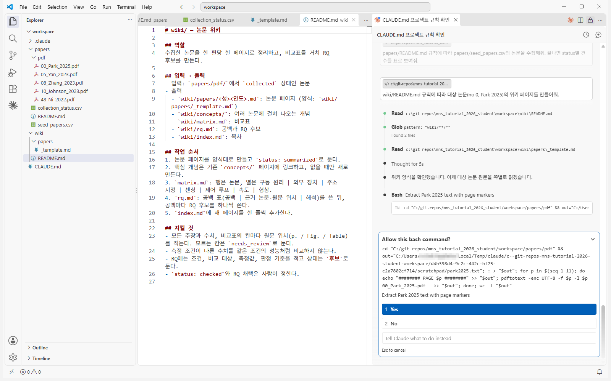

4. 완료 응답에 무엇을 만들었고 무엇을 `needs_review`로 남겼는지 나온다. 이 실행에서는 원문 안에서 같은 수치가 본문(p.3)과 그림(Fig. 2f)에 다르게 적힌 것을 찾아 `needs_review`로 남겼다.

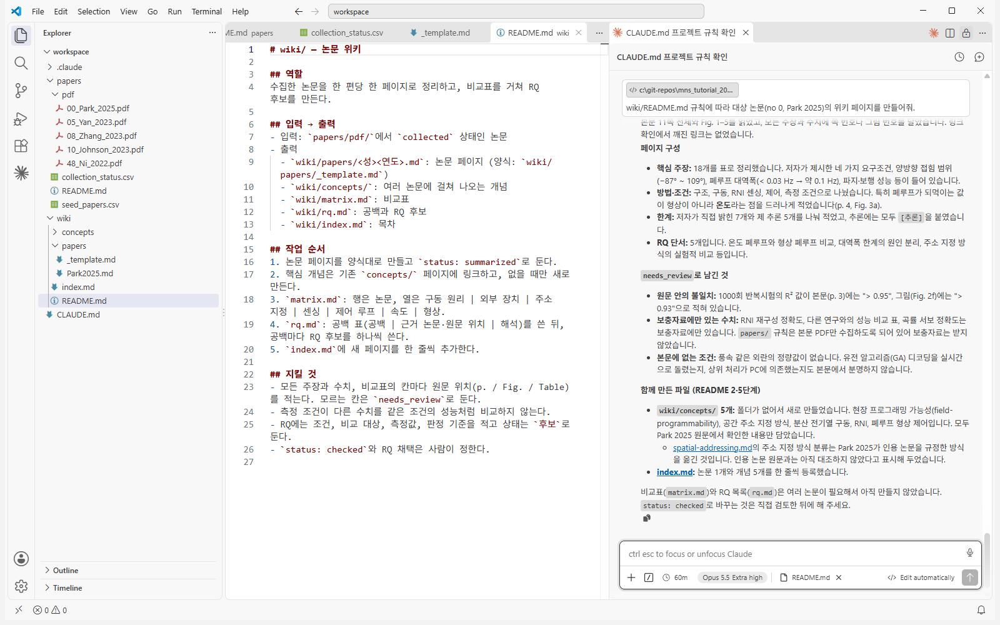

5. 만들어진 페이지를 연다. **Ctrl+Shift+V**로 마크다운 미리보기를 보면 읽기 쉽다. 주장마다 원문 쪽 번호가 붙어 있다.

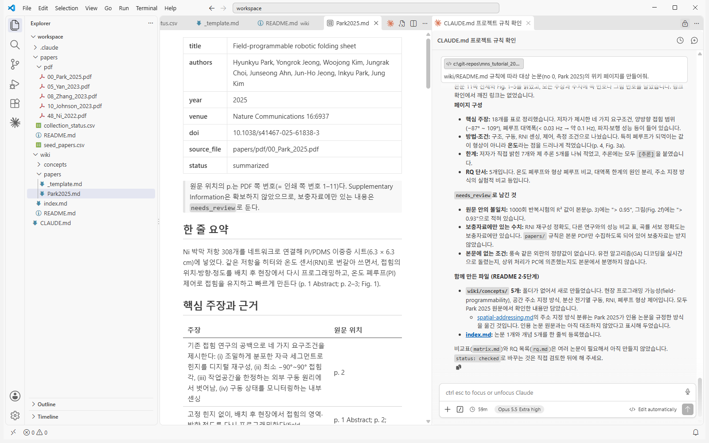

6. **원문 대조**: 페이지가 원문과 맞는지 직접 확인시킨다.

```
Park2025.md의 핵심 주장 표에서 두 번째 행을 원문 해당 쪽의 문장과 나란히 보여줘.
```

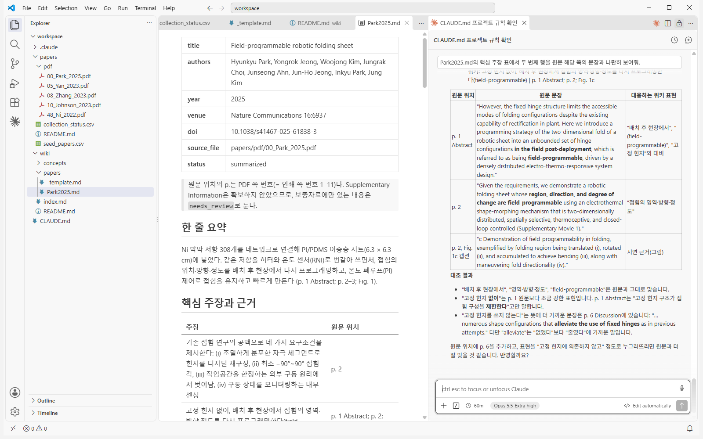

이 실행에서 에이전트는 위키의 "고정 힌지 없이"가 원문(p.1 "고정 힌지 구조가 제한한다")보다 강한 표현이라고 스스로 지적하고 수정을 제안했다. 사람이 "반영해줘"라고 답하면 바뀐 부분이 비교 화면으로 표시된다.

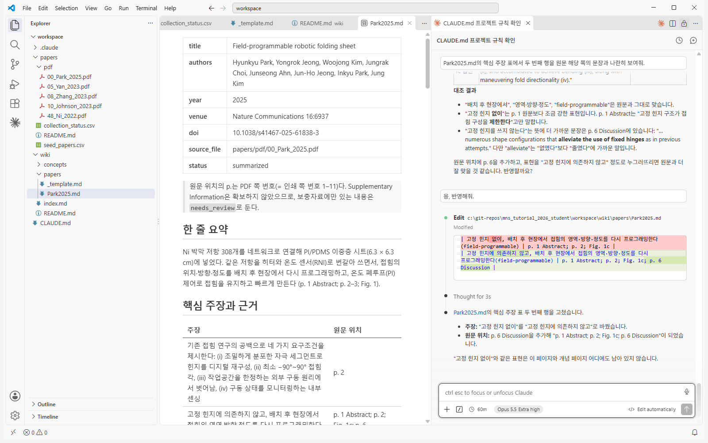

**확인**: 원문과 대조해 맞다고 판단한 뒤에만 `status: checked`로 바꾼다. 이 판단은 사람이 한다.

---

## 4단계. 비교 논문 4편 + 비교표

1. 나머지 논문을 한꺼번에 요청한다. 논문마다 서브에이전트가 따로 읽는다.

```
collected 상태인 나머지 4편도 같은 규칙으로 위키 페이지를 만들어줘. 논문마다 서브에이전트를 병렬로 써줘. 끝나면 관련 개념 페이지와 wiki/matrix.md, wiki/index.md를 갱신해줘.
```

2. 논문마다 확인 창이 여러 번 뜬다. 이 실행에서는 약 30번이었고, 모두 PDF를 읽거나 결과를 점검하는 명령이었다. 이 단계는 약 20분 걸렸다.

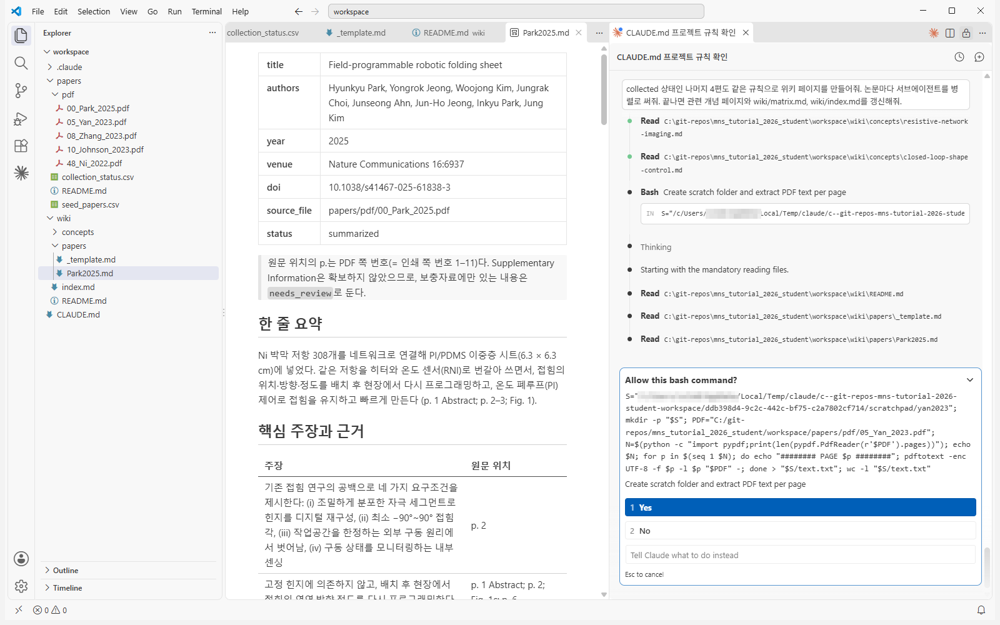

3. 완료 응답의 **비교에서 드러난 점**을 읽는다. 이 실행에서는 다음을 짚었다.
   - 표에 넣은 수치 19개를 원문에서 다시 확인했다.
   - Park 2025가 Ni 2022를 networked domain으로 분류했지만, Ni 원문에서는 리본이 서로 분리된 독립 채널이라 전기적으로는 networked domain이 아니다.
   - 속도 수치는 논문마다 지표(대역폭, 형상 형성 시간, 게이트 지연)가 달라 서로 비교할 수 없다.
   - Liu 2021(`needs_manual`)은 표에 넣지 않았다.

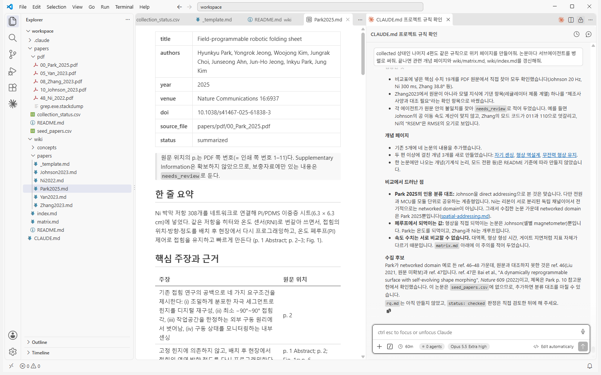

4. `matrix.md`를 미리보기(Ctrl+Shift+V)로 연다. 표가 넓으면 **Ctrl+K Ctrl+M**으로 편집기 그룹을 최대화하고 **Ctrl+B**로 탐색기를 숨긴다. 같은 키를 다시 누르면 돌아간다.

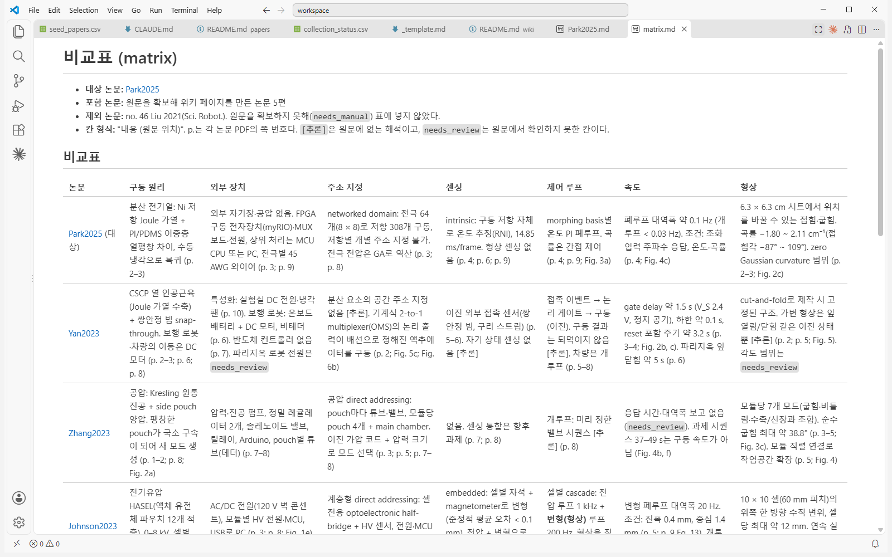

5. (선택) 허브를 만든다. 논문 페이지 frontmatter의 연도·학회·저자로 `wiki/hubs/`에 허브 페이지를 만들고, 논문 페이지마다 `허브:` 줄을 단다. 캡처에는 없는 단계다.

```
python wiki/_scripts/build_hubs.py
```

   주제 허브는 `wiki/tags.md`에 태그 어휘를 적고 논문 페이지에 `tags`를 붙여야 생긴다. 예시는 `../mns_tutorial_2026_example/wiki/tags.md`와 `wiki/hubs/`에 있다.

**확인**: 칸마다 원문 위치가 있는지, 해석에 `[추론]`이 붙었는지, 확인 못 한 칸이 `needs_review`인지 본다.

---

## 5단계. 공백에서 RQ로

1. 비교표를 근거로 공백과 RQ 후보를 요청한다.

```
wiki/matrix.md와 논문 페이지를 근거로 Park 2025의 공백을 찾아 wiki/rq.md에 공백 표와 RQ 후보 3개를 써줘. RQ마다 조건, 비교 대상, 측정값, 판정 기준을 넣어줘.
```

2. 완료 응답 끝의 **직접 검토해 주실 것**을 먼저 읽는다. 판정 기준의 값 가운데 원문에서 온 것과 새로 정한 **(제안)** 값이 구분되어 있다. 근거가 약한 공백 두 개는 RQ로 만들지 않고 따로 적어 두었다.

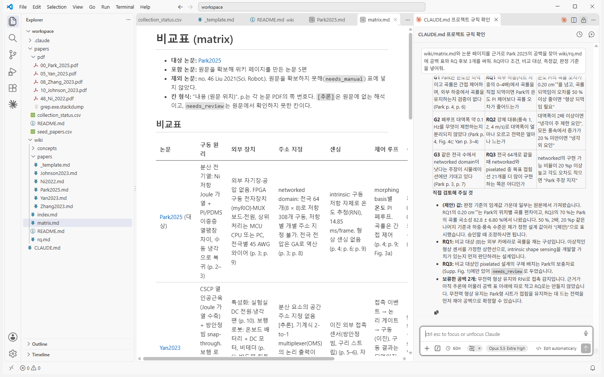

3. `rq.md`를 미리보기로 연다. 공백 표에는 공백, 근거 논문과 원문 위치, 해석(`[추론]`)이 있다.

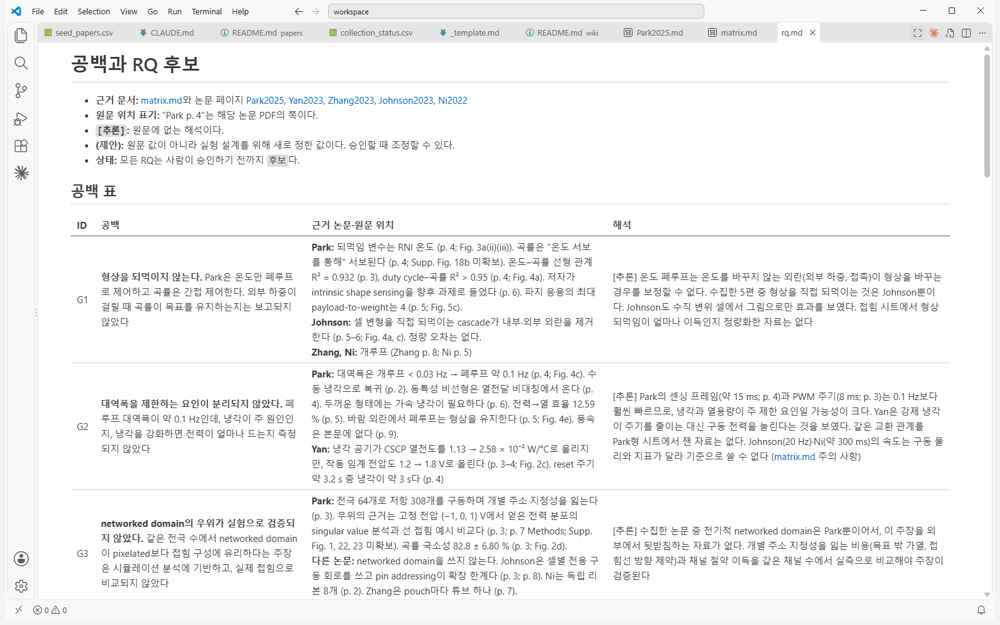

4. 아래로 내리면 RQ 후보가 나온다. 이 실행에서 나온 RQ는 다음과 같다. 상태는 모두 `후보`이고, 채택은 사람이 정한다.
   - RQ1. 외부 하중에서 형상 되먹임이 곡률 오차를 줄이는가
   - RQ2. 강제 대류 냉각이 폐루프 대역폭을 얼마나, 어떤 전력 비용으로 올리는가
   - RQ3. 같은 전극 수에서 networked domain이 pixelated domain보다 더 많은 접힘을 구현하는가

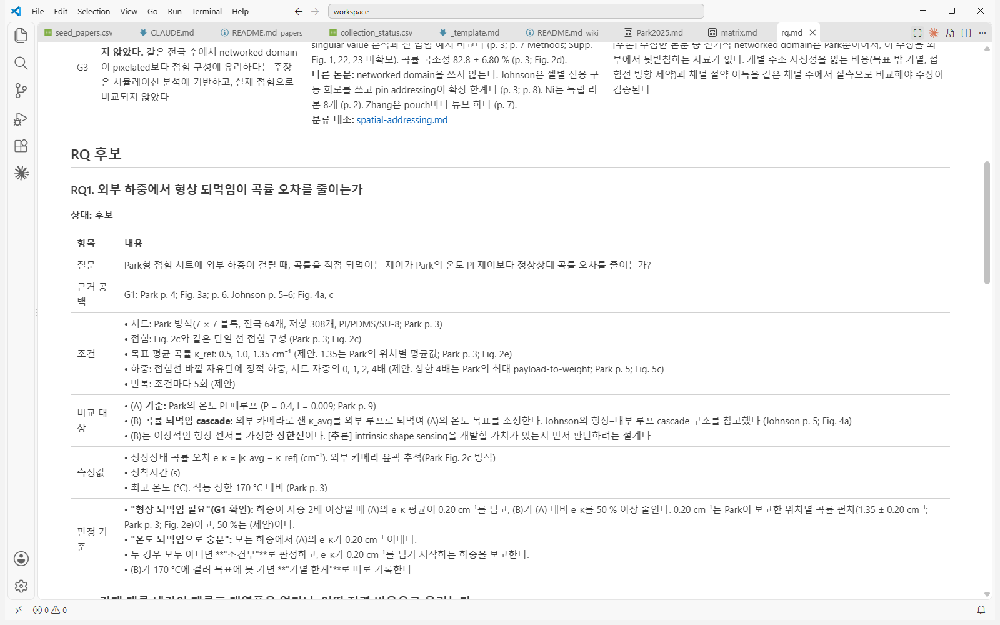

5. RQ의 근거를 원문 사실과 추론으로 나눠 보게 한다.

```
RQ1의 근거 공백을 뒷받침하는 원문 문장을 쪽 번호와 함께 보여줘. 원문 사실과 네 추론을 구분해줘.
```

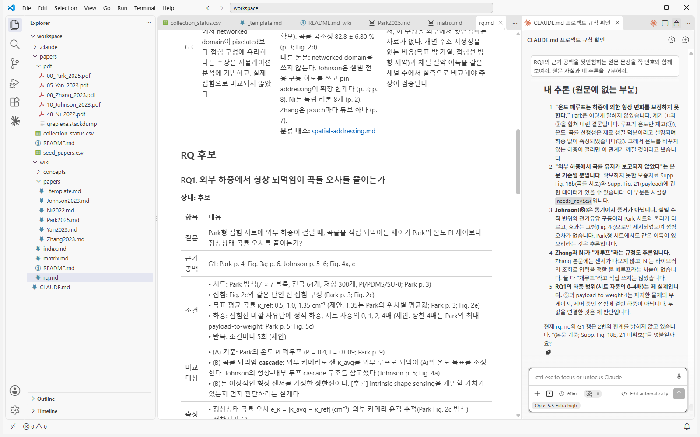

이 실행에서 에이전트는 "온도 폐루프는 하중에 의한 형상 변화를 보정하지 못한다"가 원문 문장이 아니라 여러 문장을 합친 자신의 추론이라고 밝혔다. 추론이 어디서 시작되는지 알아야 RQ를 채택할지 판단할 수 있다.

---

## 6단계(추가 실습). 위키로 대상 논문 이해하기

1–5단계의 위키는 RQ를 찾는 데만 쓰이지 않는다. 비교 논문 4편, 개념 페이지, 비교표가 이미 있으니, 이것을 배경지식으로 삼아 대상 논문을 처음 읽는 사람을 위한 설명 페이지를 만든다.

1. `explainer/README.md`를 네 칸으로 쓴다. `../mns_tutorial_2026_example/explainer/README.md`를 참고한다.
   - 작업 순서: 주장 3–5개 고르기 → 배경 개념 찾기 → 비교 논문 그림 고르기 → 대상 논문 그림과 나란히 놓기 → 게시
   - 지킬 것: 그림마다 출처와 라이선스. CC BY-NC-ND 그림은 자르지 않고 전체를, CC BY 그림은 패널만 잘라 쓰고 "일부 발췌"라고 적는다.

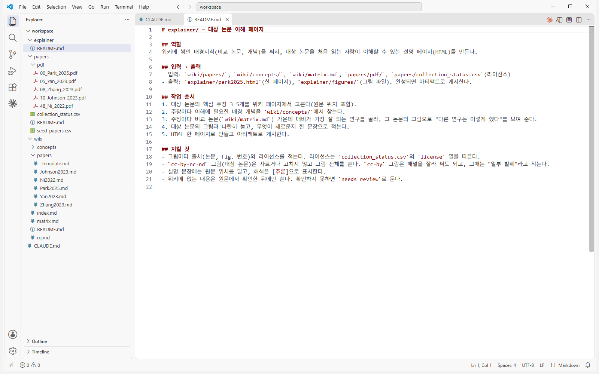

2. `CLAUDE.md`의 작업 흐름에 한 줄을 더한다.

```
5. 대상 논문 이해: `explainer/`. 위키를 배경지식으로 대상 논문 설명 페이지를 만든다. 작업 전에 `explainer/README.md`를 읽고 따른다.
```

3. Claude Code 패널에서 새 대화를 열고 요청한다.

```
explainer/README.md 규칙에 따라 대상 논문 Park 2025를 처음 읽는 사람을 위한 설명 페이지를 만들어줘. wiki에 정리한 비교 논문들의 그림을 대상 논문 그림과 나란히 놓아 무엇이 새로운지 보여 주고, 완성되면 아티팩트로 게시해줘.
```

4. 에이전트는 PDF보다 위키를 먼저 읽는다. 이 실행에서는 논문 페이지 5개와 개념 페이지 8개를 읽은 뒤에야 PDF에서 그림 위치와 캡션을 찾았다. 그림을 잘라 내고 렌더링을 확인하는 명령마다 확인 창이 뜬다(이 실행에서 16번, 약 23분).

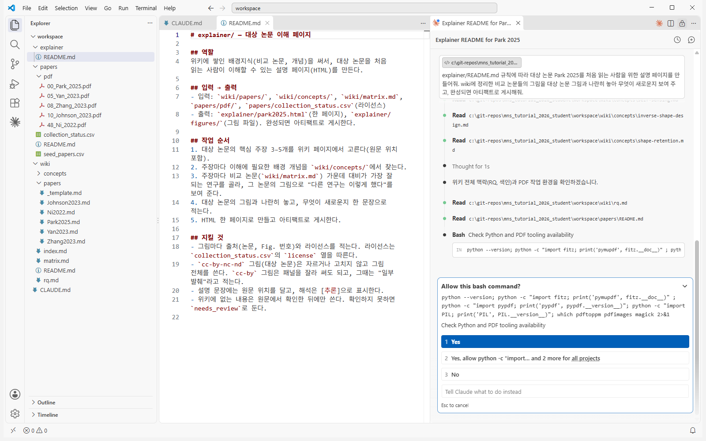

5. 완료되면 **Artifact · Published**와 링크가 나온다. 게시된 페이지는 **비공개**로 시작한다. 다른 사람에게 보여 주려면 페이지의 공유(Share) 메뉴를 쓴다.

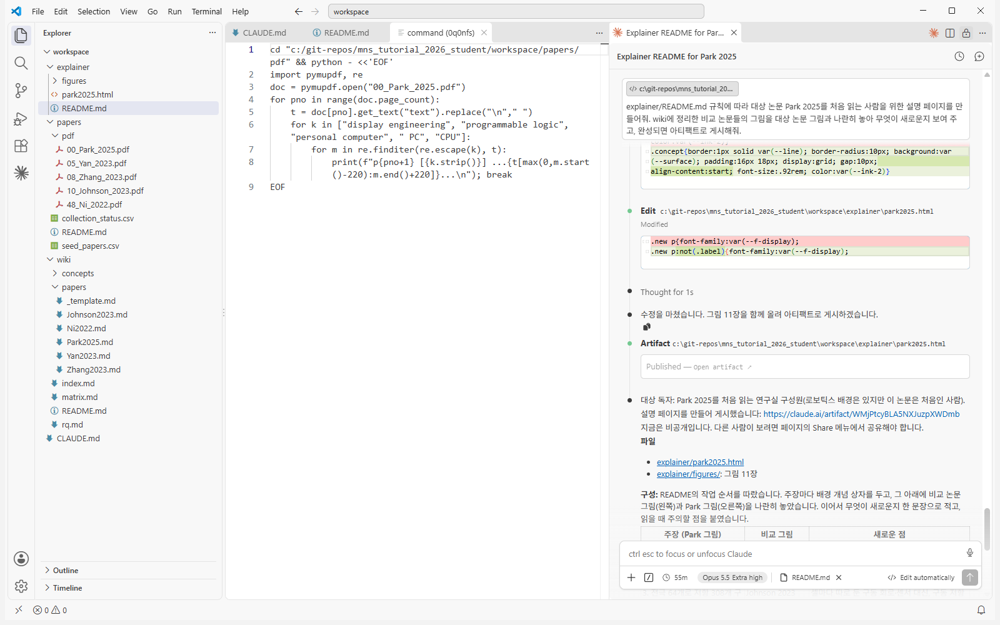

6. 응답의 구성 표를 읽는다. 주장마다 대비가 되는 비교 논문 그림이 하나씩 짝지어져 있다.

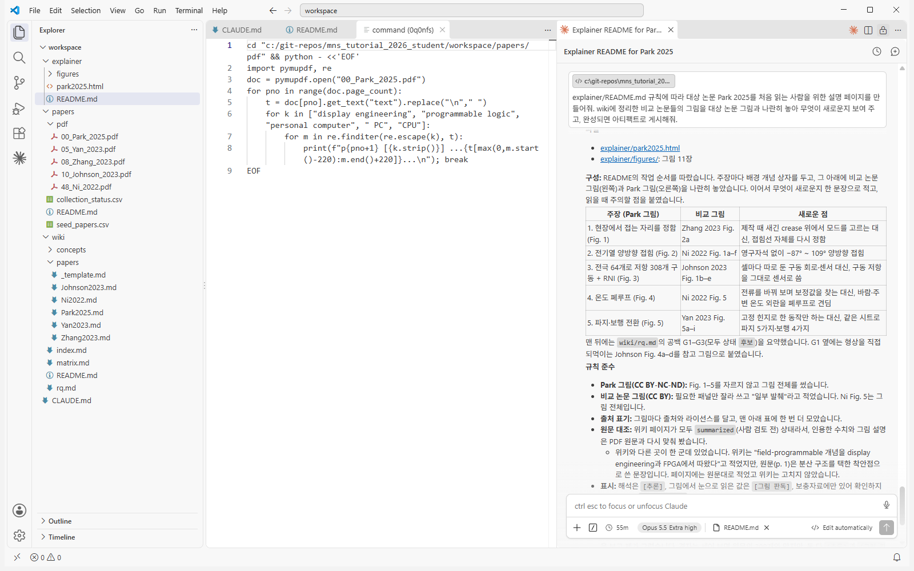

7. `explainer/figures/`에 그림 파일이 생긴다. 파일 이름에 논문과 패널이 적혀 있다(예: `johnson2023_fig1b-e.jpg`). 대상 논문 그림(`park2025_fig1–5`)은 그림 전체다.

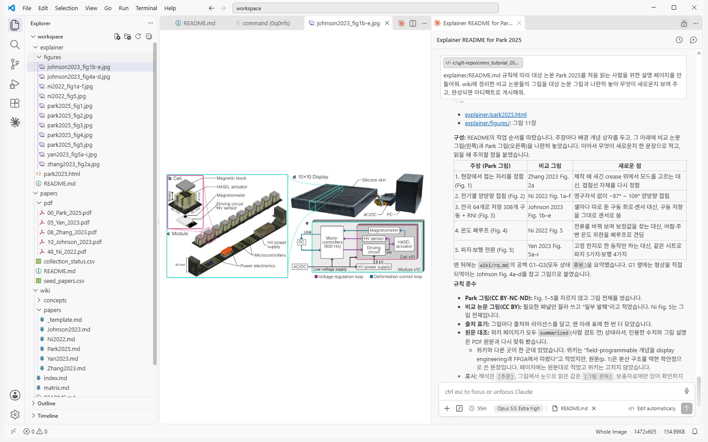

8. 링크로 페이지를 연다. 주장마다 본문(원문 위치 포함), 위키 개념 페이지에서 온 **배경 개념** 상자, **다른 연구(왼쪽)**와 **대상 논문(오른쪽)** 그림이 나란히 있다.

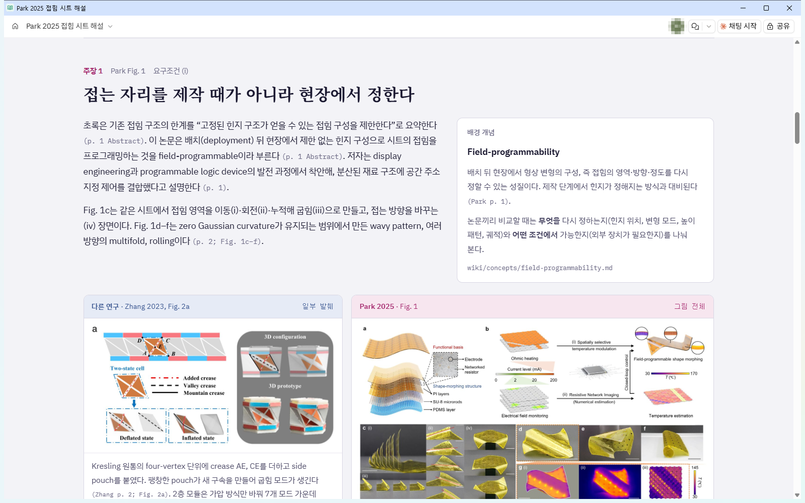

9. 그림 아래에 **새로운 점** 한 문장과 **읽을 때 주의**가 있다. 해석에는 `[추론]`이 붙어 있다.

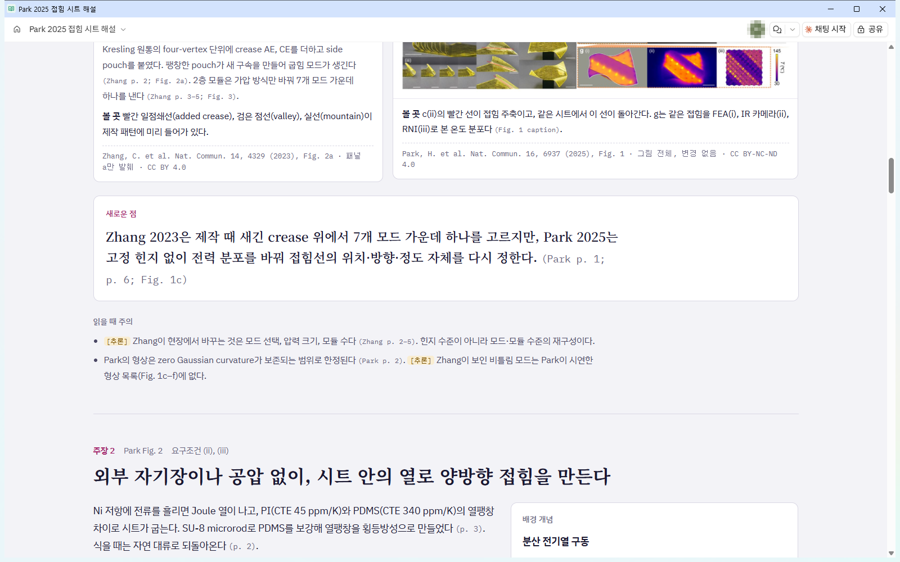

**확인**
- 그림마다 출처(논문, Fig. 번호)와 라이선스가 붙어 있는가
- 대상 논문 그림이 잘리지 않았는가
- 에이전트가 직접 그린 개념도에 `[추론]` 표시가 있는가. 이런 그림은 원문과 직접 대조한다.
- 위키와 원문이 다른 곳을 보고했는가. 이 실행에서는 위키의 "field-programmable 개념을 display engineering과 FPGA에서 따왔다"가 원문(p.1)보다 강한 표현이라 페이지에는 원문대로 썼다.

---

## 막혔을 때

| 증상 | 대처 |
|---|---|
| nature.com에서 PDF 대신 HTML이 받아진다 | Python `urllib`는 걸러지고 `requests`나 `curl`은 통과한다(2026-09-29 확인). "requests로 다시 시도해줘"라고 입력한다. |
| 네트워크가 안 된다 | `../mns_tutorial_2026_example/papers/`의 `pdf/` 폴더(PDF 5편)와 `collection_status.csv`를 이 작업공간의 `papers/`로 복사한다. |
| 확인 창이 너무 자주 뜬다 | 명령을 읽고 같은 종류라면 2번(this project)을 고른다. 범위가 **all projects**로 바뀌지 않았는지 확인한다. |
| 시간이 부족하다 | `../mns_tutorial_2026_example/`에서 해당 단계의 결과 파일을 복사해 다음 단계로 넘어간다. |
| 결과가 캡처와 다르다 | 정상이다. `../mns_tutorial_2026_example/`에 이 캡처를 찍을 때 실제로 생성된 파일이 있으니 비교해 본다. |
| 아티팩트로 게시되지 않는다 | `explainer/park2025.html`을 브라우저로 열어 확인한다. 이 실행의 결과는 `../mns_tutorial_2026_example/explainer/park2025.html`에 있다. |
| 그림을 잘라 내지 못한다 | `pip install pymupdf`로 설치한 뒤 "pymupdf로 다시 시도해줘"라고 입력한다. |

## 관련 폴더

- `../mns_tutorial_2026_example/`: 이 가이드의 캡처를 찍을 때 에이전트가 실제로 만든 작업공간(사람이 원문과 대조하지 않은 상태). 규칙 문서, OA 논문 PDF 5편(`papers/pdf/`), 위키, 6단계 결과(`explainer/`)가 들어 있다. 논문 라이선스는 그 폴더의 `LICENSES.md`
- `../research_workspace_template/`: 이 실습 구조에 큰 그림·가설·실험·원고를 더한 연구 작업공간 템플릿
